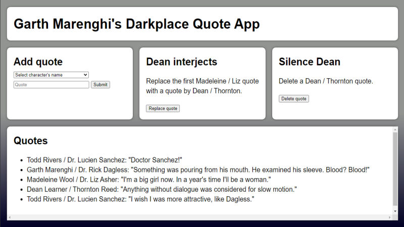

# Garth Marenghi's Darkplace Quote App
Blood? No, an app which showcases memorable quotations from Garth Marenghi's Darkplace!

**Link to project:** https://darkplace-quote-app.herokuapp.com

## How It's Made:

**Tech used:** HTML, CSS, JavaScript, Node.js, MongoDB

This app was my first full-featured CRUD app, and I built it using a tutorial by the very talented [Zell Liew](https://zellwk.com/about/) as its model. This app makes extensive use of Express.js and relies on MongoDB as its database for quotation storage. The app allows users to submit quotes, view previously submitted quotes, and replace or remove certain quotes.

## Optimizations:

I would like to implement a system that would inhibit malicious users from spamming or misusing the app. One possible solution might be adding a CAPTCHA challenge before every request, or adding a simple registration system.

## Lessons Learned:

From becoming better acquainted with Express.js to storing and retrieving data from MongoDB, I gained a wealth of knowledge from this project. My understanding of various subjects such as CRUD operations, database organization, environment variables, and secrets greatly solidified while working with them during this app's creation.

## How To Run It Locally:

1. Ensure that you have Git and Node.js installed.
2. Clone this repository (e.g., with `git clone https://github.com/warnshouse/darkplace-crud.git`).
3. Move into the directory with `cd darkplace-crud`.
4. Install the necessary dependencies with `npm install`.
5. Create a `.env` file setting the variable `DB_STRING` equal to your own database connection string.
6. Start the server with `npm start`.
7. Navigate to `localhost:3000` in your web browser and you're set!